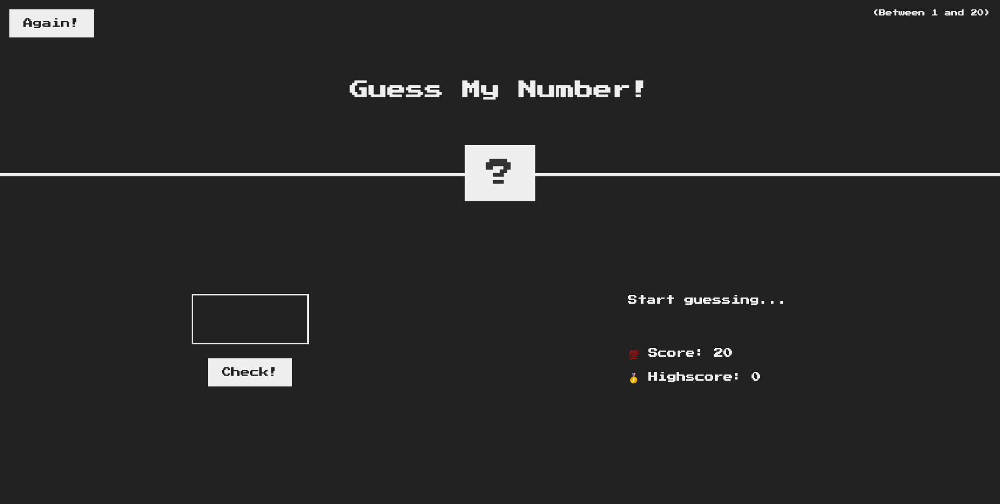
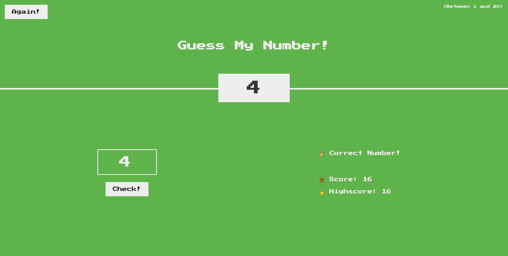

# guess-my-number

A game created using vanilla JavaScript with a retro UI that generates a random number between 1-20 and allows user to enter a number to guess the generated number. Users can select 'again' to play again and attempt to beat their high score which is displayed. GMN utilizes DOM manipulation and event listeners.

